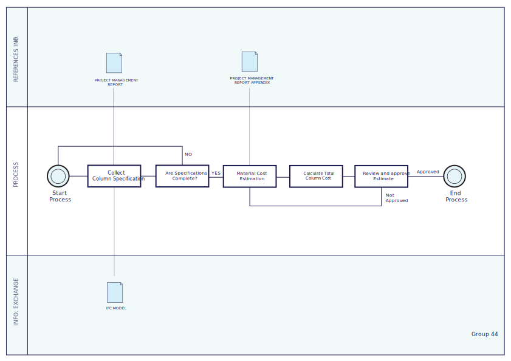

# Assignment A2: Use Case

### A2a
The group's confidence in Python is: 0+1=1

### A2b
This verification focuses on the construction cost in *Building #2406* as presented in the *project management report*. Specifically, the construction cost associated with all columns in the building will be checked. The information about the columns is found on page 6 in *PM Appendix*, where detailed descriptions of each construction element are provided.
The claim involves calculating the total cost for all concrete columns by deriving the cost from the volume of concrete used for these columns and multiplying it by the average unit cost. While the *PM appendix* specifies distinct unit costs for small and large columns, the dimensions of these columns do not match consistently across the structural model. Therefore, to maintain a coherent calculation, the average unit price is used for all columns.
By checking this claim, we aim to ensure the accuracy and reliability of the construction cost estimates related to structural elements. This verification will contribute to maintaining overall financial integrity in the project and ensure that cost management practices are appropriately followed.

### A2c
This claim will be checked by extracting data from the IFC file, using the average unit cost, calculating the total cost, and comparing the total cost with the documentation in the report.
This claim needs to be checked when the structural model is developed but before finalizing the budget or construction contracts. This ensures that any discrepancies can be addressed prior to committing resources.
This claim relies on the following information:
1.	Geometric and material information from the IFC file
2.	Standard costs of square meters of columns based on Molio.dk
3.	Total volume/square meters of the columns

This claim is relevant during the design phase as it involves assessing construction cost based on the design elements in the structural model.
The first BIM purpose required is gathering. This refers to extracting relevant data from the IFC file, which includes the geometric and material information about all concrete columns. Secondly, the BIM purpose analyzing is required. This involves calculating the total volume of concrete columns and using the average unit cost to derive the total construction cost, allowing for an assessment of accuracy in the financial estimates
The closest BIM use case is Penn State’s BIM use case under Plan: Cost analysis, Bill of quantities, 02: Cost Estimation. This use case focuses on using BIM for precise quantity take-offs and cost estimation throughout a project's lifecycle, which aligns with our task of calculating the total cost of columns by extracting volumes from the model and multiplying them by unit prices. It enables accurate material quantification, faster cost analysis, and helps in decision-making during the design stage.

### A2d
From the overall use case of cost estimation, a specific function is required for calculating the total volume and cost of concrete columns. This involves automating the extraction of column dimensions and properties from the IFC file using ifcOpenShell. The script would:
- Identify all concrete columns.
- Calculate their total volume.
- Apply the average unit cost.
- Output the total estimated cost.

### A2e
The IFC Column Cost Estimator is a Python-based tool using *ifcOpenShell* to automate the extraction of column properties from an IFC model. It calculates the total volume of all concrete columns, retrieves the average unit price (considering various column sizes), and multiplies these to estimate the total cost of columns in the project.
The business value of the tool is that it saves time and increases accuracy in cost estimation by automating the process, minimizing human error in data extraction and calculation. It provides quicker turnaround for cost assessments, aiding in budget control during early design stages.
The societal value is that it promotes transparency and accountability in construction projects by providing stakeholders with accurate, data-driven cost estimations. This can help in preventing budget overruns and ensuring better resource allocation.

### A2f
Information to extract: Geometric data such as length, width, and height of the columns.
The geometric data can be found under *IfcColumn*, perhaps *IfcShapeRepresentation*. Material properties can also be found in *IfcMaterial* linked to *IfcColumn*. Location data can be derived from *IfcLocalPlacement* of each *IfcColumn*.
The required information should be imbedded in the Ifc model if the model is detailed properly.
With *IfcOpenShell*, elements like *IfcColumn* can be retrieved using *ifc.get()* and *if.get_representation()*.
To do this we will need to get a deeper understanding of *IfcShapeRepresentation* and the basics of Ifc to calculate column volumes and filter out the relevant columns.

### A2g
For this course GPL-3.0 is the software license used.
